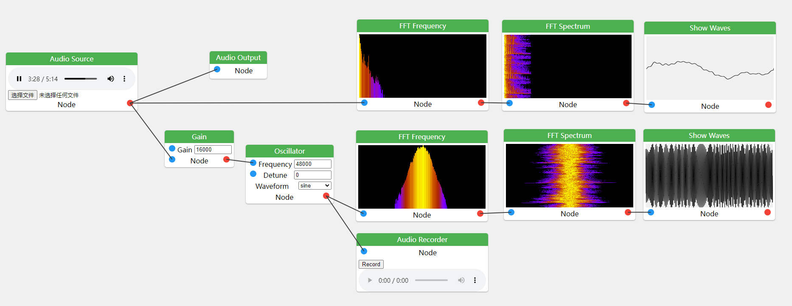

# WebAudio Playground

## <a href=https://haveyouwantto.github.io/webaudio-playground/>Open in Github Pages</a>

Webaudio Playground is a browser application that allows users to control the webaudio API through an interactive flowchart.

With Webaudio Playground, users can create, manipulate, and playback audio in the browser without having to write a single line of code. The interactive flowchart interface makes it easy to connect and arrange different audio nodes, allowing users to create complex audio processing pipelines with ease.

Webaudio Playground also includes a wide range of built-in audio nodes for tasks such as filtering, modulation, and spatialization. Additionally, users can import their own audio files and use them as inputs in their processing pipelines.

Whether you're a professional audio engineer, a music producer, or just someone who enjoys experimenting with sound, Webaudio Playground offers a fun and intuitive way to create and manipulate audio in the browser. Give it a try today!

FM Modulation with WebAudio API

-----
Currently, nodes can only be added with hotkeys.

| Key | Node | Description |
| --- | ---- | ----------- |
| O | Oscillator | Generates a periodic waveform, such as a sine, square, or sawtooth wave. |
| G | Gain | Amplifies or attenuates the volume of an audio signal. |
| C | Dynamics Compressor | Compresses the dynamic range of an audio signal, reducing the volume of loud sounds and increasing the volume of quiet sounds. |
| P | Panner | Controls the spatialization of an audio signal, allowing users to position the sound in 3D space. |
| S | Audio Source | Imports an audio file from the user's local storage and provides it as an input to the audio processing pipeline. |
| R | Audio Recorder | Records the output of the audio processing pipeline and saves it to a file on the user's local storage. |
| D | Delay Audio | Adds a delay effect to an audio signal, causing the sound to delay for a certain time. |
| T | Stereo Panner | Similar to the Panner node, but specifically designed for stereo audio signals. |
| B | Biquad Filter | Applies a biquad filter to an audio signal, allowing users to apply common filter effects such as low-pass, high-pass, and band-pass filtering. |
| W | Show Waves | Displays a graphical representation of the audio waveform at the current point in the processing pipeline. |
| F | Show Frequency | Displays a spectral analysis of the audio signal, showing the distribution of energy across different frequencies. |
| H | FFT Waterfall | Similar to the Show Frequency node, but displays a waterfall of the audio signal. |
| N | White Noise Generator | Generates a random noise signal with a flat spectrum, useful for adding background noise or creating percussive sounds. |
| I | Audio Live Input | Captures audio from the user's microphone and provides it as an input to the audio processing pipeline. |